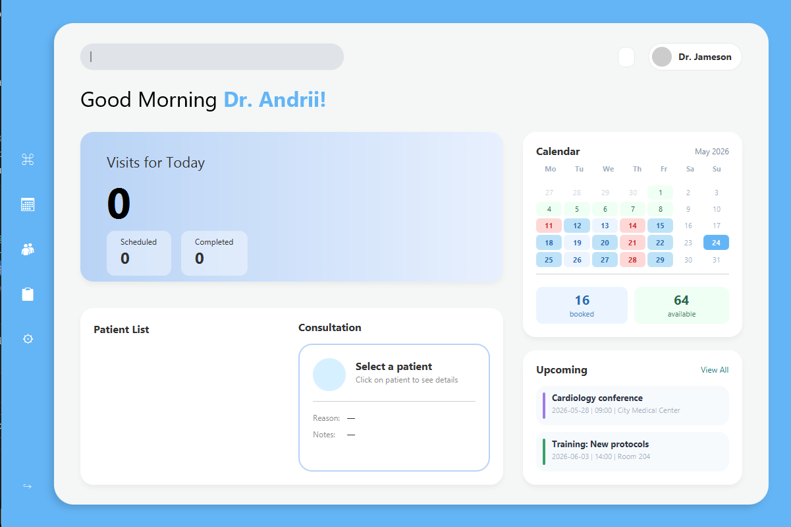
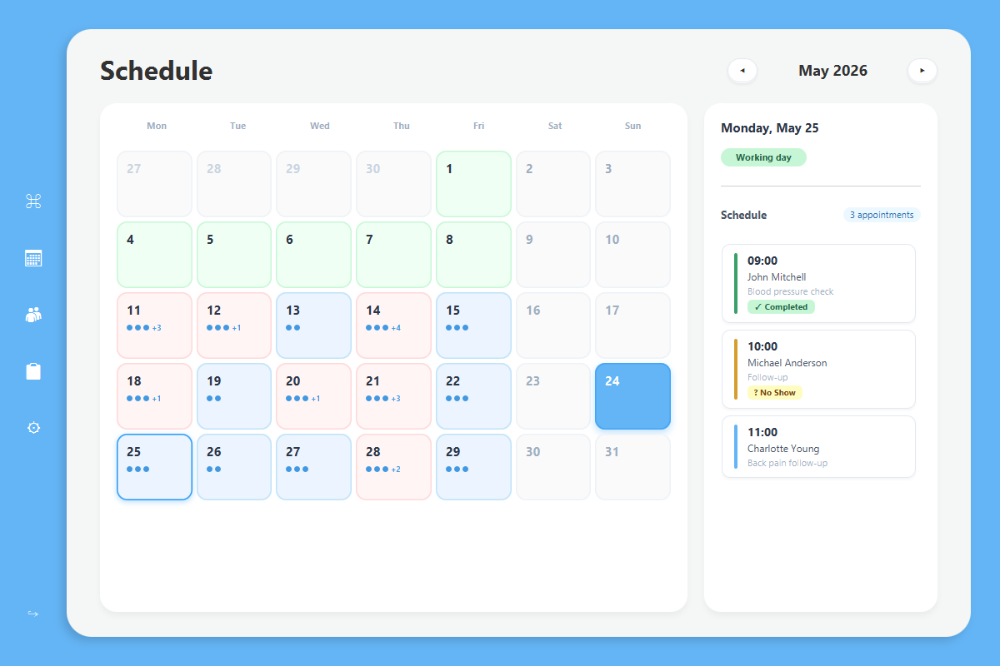
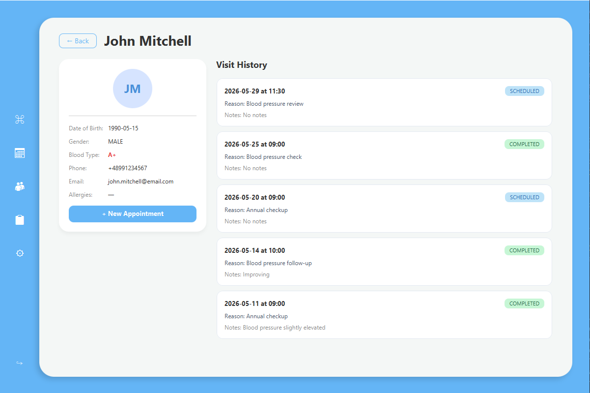
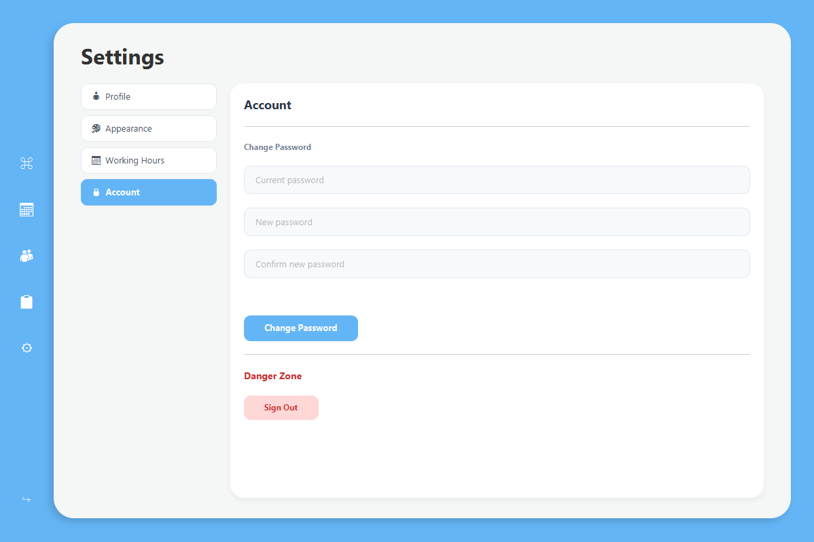

# Likarnyam — Medical Portal

A desktop medical CRM application for doctors built with JavaFX and Spring Boot.


---

## Features

- **Authentication** — JWT-based login with Remember Me (30 days)
- **Home Dashboard** — daily appointments, mini calendar, upcoming events
- **Patient Management** — full patient list with search, patient cards with visit history
- **Schedule** — interactive monthly calendar with appointment density visualization
- **Appointments** — full appointment list with filtering by status
- **New Appointment** — book appointments with available time slot selection
- **Settings** — profile editing, password change

## Tech Stack

### Backend
- Java 17
- Spring Boot 4.0.6
- Spring Security + JWT (jjwt 0.12.3)
- Spring Data JPA + Hibernate
- PostgreSQL
- Flyway (database migrations)
- Lombok

### Frontend
- JavaFX 21.0.2
- Jackson (JSON parsing)
- Java HTTP Client

## Architecture

```
likarnyam/
├── likarnyam-backend/    # Spring Boot REST API (port 8080)
└── likarnyam-frontend/   # JavaFX desktop application
```

The frontend communicates with the backend via HTTP REST API using JWT authentication.

## Getting Started

### Prerequisites
- Java 17+
- PostgreSQL 14+
- Maven 3.8+

### Backend Setup

1. Create a PostgreSQL database:
```sql
CREATE DATABASE likarnyam;
```

2. Configure `application-local.yml`:
```yaml
spring:
  datasource:
    password: your_password
```

3. Run the backend:
```bash
cd likarnyam-backend
mvn spring-boot:run -Dspring-boot.run.profiles=local
```

Flyway will automatically create all tables and seed initial data.

### Frontend Setup

1. Run the frontend:
```bash
cd likarnyam-frontend
mvn javafx:run
```

### Default Credentials
```
Email:    doctor@likarnyam.com
Password: password123
```

## API Endpoints

| Method | Endpoint | Description |
|--------|----------|-------------|
| POST | `/api/auth/login` | Login, returns JWT token |
| PATCH | `/api/auth/password` | Change password |
| GET | `/api/doctors/me` | Get current doctor profile |
| PATCH | `/api/doctors/me` | Update doctor profile |
| GET | `/api/patients` | Get all patients |
| GET | `/api/patients/{id}` | Get patient by ID |
| POST | `/api/patients` | Create new patient |
| GET | `/api/appointments` | Get all appointments |
| GET | `/api/appointments/today` | Get today's appointments |
| POST | `/api/appointments` | Create appointment |
| PATCH | `/api/appointments/{id}/status` | Update appointment status |
| GET | `/api/schedule/me` | Get doctor's schedule |
| GET | `/api/schedule/slots` | Get available time slots |
| GET | `/api/schedule/calendar` | Get monthly calendar data |
| GET | `/api/events/upcoming` | Get upcoming events |

## Screenshots
> Home Dashboard — daily overview with patient list, calendar and upcoming events

> Schedule — interactive monthly calendar with appointment density and status management

> Patient Card — detailed patient information with visit history

> Settings — profile management and account settings


## Project Status

This is an MVP (Minimum Viable Product) with core functionality implemented.
Planned features: dark theme, appointment editing, analytics dashboard.

## License

MIT
